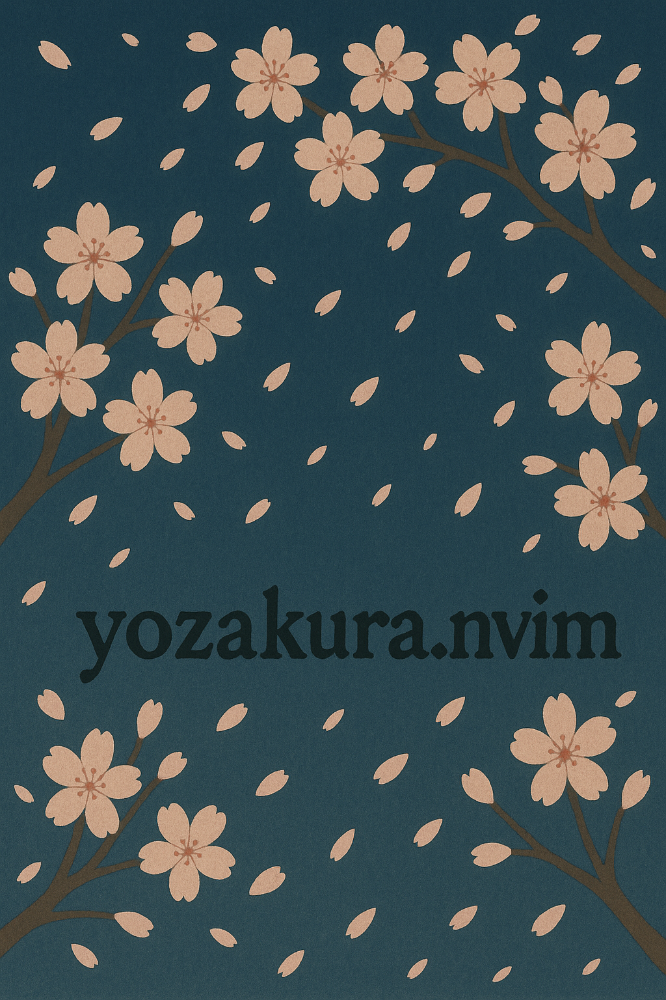
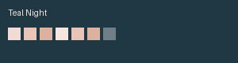
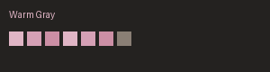
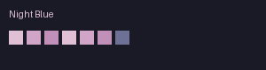

# 🌸 Yozakura.nvim

<div align="center">
  
</div>

A Neovim colorscheme inspired by cherry blossoms at night, designed with eye comfort and readability in mind.

## Requirements

- Neovim >= 0.8.0
- Terminal with true color support
- [nvim-treesitter](https://github.com/nvim-treesitter/nvim-treesitter) (highly recommended for proper syntax highlighting)

## Features

- 🎨 **Four carefully crafted palettes**:
  - `teal_night`: Deep teal night with salmon pink accents for unique aesthetics
  - `warm_gray`: Warm gray base that reduces blue light exposure (デフォルト)
  - `muted_rose`: Muted rose tones with perfect balance of visibility and comfort
  - `night_blue`: Night-themed with blue accents for late-night coding
- 👁️ **Eye-friendly design**: Scientifically designed contrast ratios to minimize eye strain
- 🔍 **High readability**: WCAG AAA compliant color combinations
- 🌙 **Dark theme optimized**: Perfect for low-light environments
- 🎯 **Full Treesitter support**: Complete highlighting for Neovim 0.9+ Treesitter groups
- 🌍 **Language-specific optimizations**: Tailored highlights for popular languages (Lua, TypeScript, Python, Rust, Go, C++, Java, and more)
- 🔧 **LSP semantic tokens**: Enhanced highlighting with LSP semantic tokens support

## Installation

### Using [lazy.nvim](https://github.com/folke/lazy.nvim)

```lua
-- Method 1: Using opts (simplest)
{
  "shabaraba/yozakura.nvim",
  lazy = false,
  priority = 1000,
  opts = {
    palette = "night_blue",
    transparent = true,
  },
}

-- Method 2: Using config function (if you need more control)
{
  "shabaraba/yozakura.nvim",
  lazy = false,
  priority = 1000,
  config = function()
    require("yozakura").setup({
      palette = "night_blue",
      transparent = true,
    })
  end,
}
```

### Using [packer.nvim](https://github.com/wbthomason/packer.nvim)

```lua
use {
  "shabaraba/yozakura.nvim",
  config = function()
    require("yozakura").setup({
      -- Your configuration here
    })
    vim.cmd.colorscheme("yozakura")
  end
}
```

## Configuration

```lua
require("yozakura").setup({
  transparent = false,       -- Enable transparent background
  italic_comments = true,    -- Use italic for comments
  dim_inactive = false,      -- Dim inactive windows (not implemented yet)
  palette = "warm_gray", -- "teal_night" | "warm_gray" | "muted_rose" | "night_blue"
  styles = {
    comments = { italic = true },
    keywords = { italic = false },
    functions = { italic = false },
    variables = { italic = false },
  },
})
```

## Commands

Yozakura provides commands to switch palettes on the fly:

```vim
:YozakuraTealNight      " Switch to teal night palette
:YozakuraWarmGray       " Switch to warm gray palette (デフォルト)
:YozakuraMutedRose      " Switch to muted rose palette
:YozakuraNightBlue      " Switch to night blue palette

" Or use the generic command with tab completion
:YozakuraPalette <palette_name>
:YozakuraPalette teal_night
:YozakuraPalette warm_gray
:YozakuraPalette muted_rose
:YozakuraPalette night_blue
```

You can also switch palettes programmatically:

```lua
-- Switch to a specific palette
require('yozakura').set_palette('teal_night')
require('yozakura').set_palette('warm_gray')
require('yozakura').set_palette('muted_rose')
require('yozakura').set_palette('night_blue')

-- Switch back to default (warm_gray)
require('yozakura').set_palette(nil)
```

## Gallery

<div align="center">

### Teal Night


*Deep teal night with salmon pink accents - unique and elegant design*

### Warm Gray  


*Warm gray base colors that reduce blue light exposure for minimal eye strain*

### Muted Rose


*Subtle rose tones with excellent color distinction and focus enhancement*

### Night Blue


*Night-themed palette with blue accents, perfect for late-night coding sessions*

</div>

## Palette Options

### Using Teal Night
```lua
palette = "teal_night"
```

### Using Warm Gray (Default)
```lua
palette = "warm_gray"  -- or omit for default
```

### Using Muted Rose
```lua
palette = "muted_rose"
```

### Using Night Blue
```lua
palette = "night_blue"
```

### Transparent Background
```lua
require("yozakura").setup({
  transparent = true,
  palette = "night_blue"
})
```
Enable transparent background to blend with your terminal background.

## Color Design Principles

1. **Appropriate Contrast**: 7:1-10:1 contrast ratios to prevent eye fatigue
2. **Warm Color Base**: Reduced blue light for comfortable extended use
3. **Adjusted Saturation**: Non-glaring colors that maintain distinctiveness
4. **Gradual Brightness**: Natural depth perception from background to foreground
5. **Consistent Hue**: Unified pink-to-rose color scheme to reduce cognitive load

## Development

This colorscheme is developed using [lush.nvim](https://github.com/rktjmp/lush.nvim) for easier maintenance and color adjustments.

### For Contributors

If you want to modify the colorscheme:

1. Install lush.nvim:
```lua
-- Using lazy.nvim
{ 'rktjmp/lush.nvim' }
```

2. Edit the lush definition:
```bash
nvim lua/lush_theme/yozakura.lua
```

3. Live preview your changes:
```vim
:Lushify
```

4. Compile to Lua (generates runtime files):
```bash
./scripts/compile-lush.lua
```

5. Commit the compiled files:
```bash
git add lua/yozakura/compiled/
git commit -m "chore: update compiled colorscheme files"
```

**Important Notes**:
- End users don't need lush.nvim installed. It's only required for development.
- The compiled files in `lua/yozakura/compiled/` **must be committed** to the repository.
- Always run the compile script after modifying `lua/lush_theme/yozakura.lua`.

## License

MIT License - see [LICENSE](LICENSE) for details.

## Credits

Inspired by the beauty of cherry blossoms (桜) at night.
